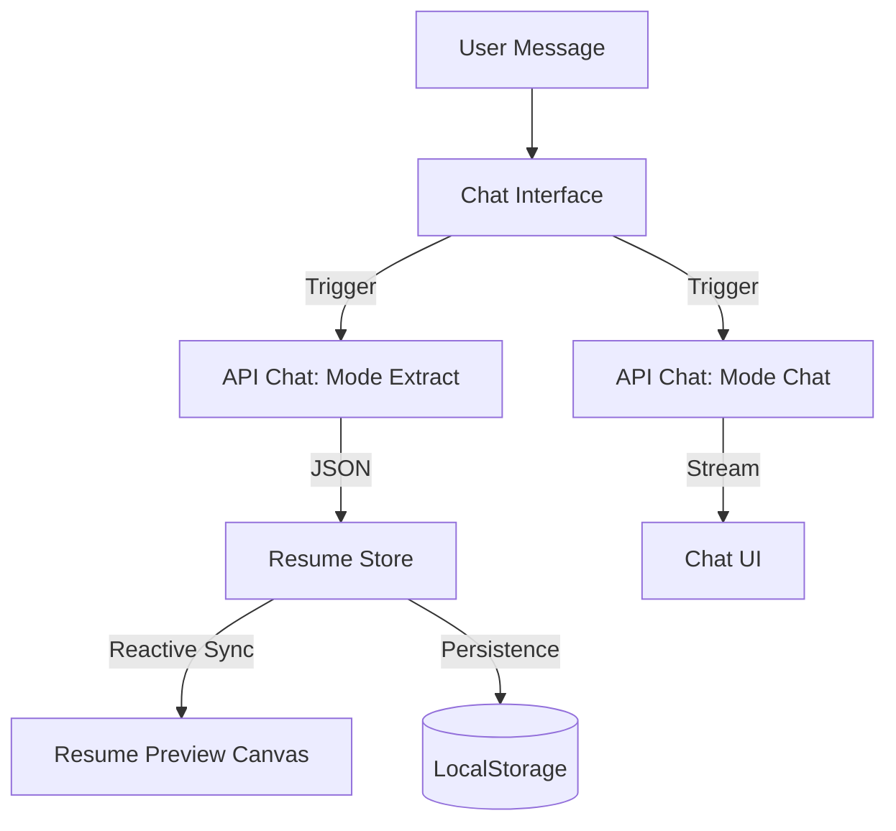

# 🚀 AI Resume Builder

A modern, production-ready AI resume builder that feels like chatting with a professional career coach. It collects your details conversationally and generates a structured, ATS-friendly resume in real time.

---

## ✨ Features

- **💬 Conversational UI**: Build your resume through a natural chat interface (powered by `gpt-4o`).
- **🧠 Dual-Stream AI**: Parallel processing for data extraction and conversational guidance.
- **⚡ Real-Time Preview**: Watch your resume update instantly as you provide information.
- **💾 Auto-Persistence**: Progress is automatically saved to `localStorage`.
- **🎨 Professional Templates**: Choose between "Modern" and "Classic" designs.
- **📥 One-Click Export**: High-quality PDF generation via browser-optimized print styles.
- **🔄 Smart Refinement**: Ask the AI to "make my summary more professional" or "improve my bullet points" after the initial draft.

---

## 🏗️ Architecture & Tech Stack

| Layer            | Technology |
|------------------|-----------|
| **Framework**    | [Next.js 15](https://nextjs.org/) (App Router) |
| **Styling**      | [Tailwind CSS](https://tailwindcss.com/) |
| **AI SDK**       | [Vercel AI SDK](https://sdk.vercel.ai/) |
| **Model**        | OpenAI `gpt-4o` |
| **Icons**        | [Lucide React](https://lucide.dev/) |
| **State**        | Custom React Hooks + `localStorage` |
| **PDF Export**   | CSS Print Media + `window.print()` |

---

## 🧠 The Chat System: "The Brain"

The core magic of the application lies in its **Dual-Stream Processing** model. Every user message triggers two distinct AI processes to ensure both a smooth conversation and accurate data updates.



### 1. Data Extraction Mode (`mode: "extract"`)
The system sends a background request to the AI with instructions to **only** extract relevant resume data from the user's natural language input.
- **Input**: *"I worked at Meta as a Senior SWE from 2021 to 2023."*
- **Output**: `{ "experience": [{ "company": "Meta", "role": "Senior SWE", "years": "2021 - 2023" }] }`
- **Result**: The resume preview updates instantly without interrupting the conversation.

### 2. Conversational Mode (`mode: "chat"`)
Simultaneously, a second request handles the human side of the interaction, streaming a conversational reply to guide the user to the next step.
- **Output**: *"That's impressive experience at Meta! Now, can you tell me about your education?"*

---

## 🛠️ Getting Started

### 1. Prerequisite
Ensure you have an **OpenAI API Key**.

### 2. Installation
```bash
npm install
# or
pnpm install
```

### 3. Environment Setup
Create a `.env.local` file in the root directory:
```bash
OPENAI_API_KEY=your_openai_api_key_here
```

### 4. Development Server
```bash
npm run dev
```
Open [http://localhost:3000](http://localhost:3000) in your browser.

---

## 📄 Resume Preview & Export

- **Dynamic Templates**: Switch between layouts in the toolbar. This only changes the CSS, keeping your data intact.
- **PDF Generation**: The "Download PDF" button triggers a specially styled print view (A4 size) to ensure high-quality output for applications.

## 🚀 Future Roadmap
- [ ] Multiple resume templates marketplace
- [ ] AI-based job description matching (Tailor resume to job)
- [ ] Cover letter generator based on the current resume
- [ ] LinkedIn profile import functionality
- [ ] Real-time grammar and impact scoring
